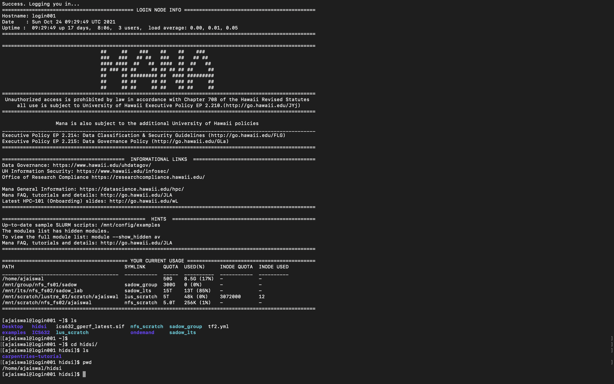
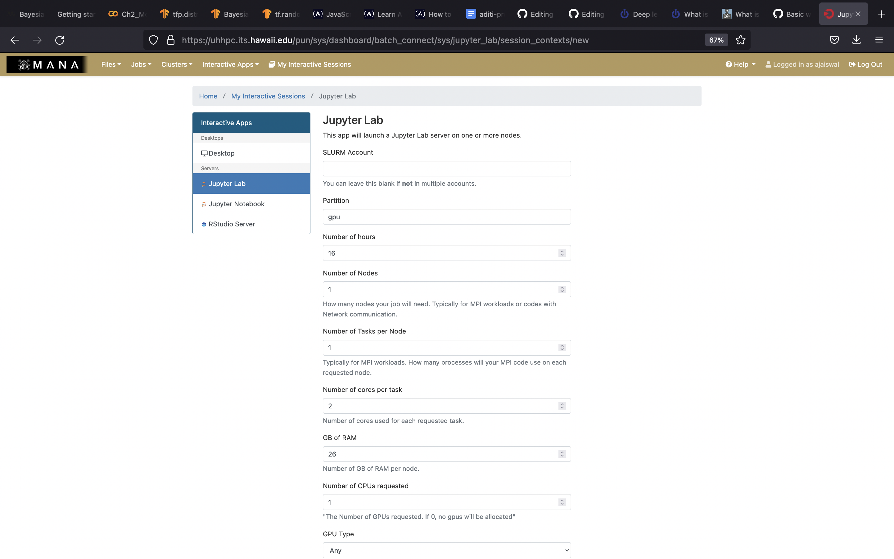

## Connecting to UH-HPC cluster Mana (SSH vs OOD)

On logging into a cluster, you are into a login node which has limited storage and restricted use because it is being shared by everybody so you submit your jobs to a compute node to get required resources for your research work. There are 2 ways to access these compute nodes on the cluster:
1. Using Secure Shell (SSH)
   - done using Linux like commands in terminal (also known as Command Line Interface or CLI),
   - login using **ssh <username>@mana.its.hawaii.edu**
  
  
  
2. Open On Demand (OOD)
   - a web based interface (or graphical user interface (GUI),
   - easy to access,
   - use interactive apps like Jupyter, RStudio and even Linux shell,
   - easy access to file systems as well.
  
 
                                             
  
## Jupyter Lab vs Jupyter Notebook

Jupyter notebook allows you to access .ipynb files only, i.e. it will create a computational environment which stores your code, results, plots, texts etc. And here you can work only in one of your environment. But Jupyter Lab gives a better user interface along with all the facilties provided by the notebook. It has a modular structure where one can access .py, .ipynb, html or markdown files, access filebrowser, all in the same window. 
  
### Jupyter Lab
It is a flexible, web based application which is mainly used in data science and machine learning research. It gives you acess to file browser (to upload, download, copy, rename, delete files), do data visualization, add data, code, texts, equations all in one place, use big data tools, share your work with others. It supports more than 40 programming languages and has an interactive output. 
  
**Q. How does it work?**
  
You write your code or plain text in rectangular “cells” and the browser then passes it to the back-end “kernel”, which runs your code and returns output.

`Note: .ipynb file is a python notebook which stores code, text, markdown, plots, results in a specific format but .py file is a python file which only stores 
 code and plain text (like comments etc).`  
  
## How to access and install softwares and modules on cluster?
  
### Package Managers:
Software packages already installed on the cluster which we can use to install required libraries, softwares and can even choose which version to install.
You can use following commands to see what modules are available on the cluster or which ones are already loaded or to load a specific module in your environment:

~~~
  module avail
  module list 
  module load <MODULE_NAME>
~~~
{: .source}
  
1. Pip: tool to install Python software packages only. 

2. Anaconda (or Conda): cross platform package and environment manager which lets you access C, C++ libraries, R package for scientific computing along with Python.
  
`Note: package contains all the files you need for a module`  

### Anaconda
- allows you to install softwares written in any programming language,
- flexibility to create different environments with different software versions,
- can use both CLI and GUI
  
> If you try to access a library with different version based on your project, pip may throw an error. To create isolated environments you can use virtual environment (venv) with pip.
  
## Environment setup

> ### **Challenge 1**
  
> 1. Request for resources
>
> * Go to mana.its.hawaii.edu and sign-in using your UH credentials  
> * Interactive Apps -> Jupyter Lab -> partition: gpu -> Time: 2 hours -> Nodes: 1 -> Tasks: 1 -> Cores: 2 -> RAM: 10 -> # of GPU: 1 -> GPU Type: any
> * Launch the session and open Jupyter Notebook
>  
> 2. Create a conda environment
>  
> 3. Download libraries
{: .challenge} 
  
## Deep Learning Tutorial

This is a basic image classification tutorial from CIFAR-10 dataset using tensorflow. 
  
**Q. What is CIFAR-10 dataset?**
  
CIFAR-10 is a common dataset used for machine learning and computer vision research. It is a subset of 80 million tiny image dataset and consists of 60,000 images. The images are labelled with 10 different classes. So each class has 5000 training images and 1000 test images. Each row represents a color image of 32 x 32 pixels with 3 channels (RGB).   
 
```
 What is Tensorflow? It is an open source software used in machine learning particularly for training neural networks. We'll define our model using 'Keras'- a high level API which acts as an interface between tensorflow and python and makes it easy to build and train models.
```
  
> **Q. But what is HDF5 and why use HDF5 file format?**
> 
> CIFAR-10 dataset is a comparatively smaller dataset as compared to other real-life datasets which are used in AI research. And this where Hierarchical Data Format (HDF5) comes in play as it supports large, complex file system.
  


  



