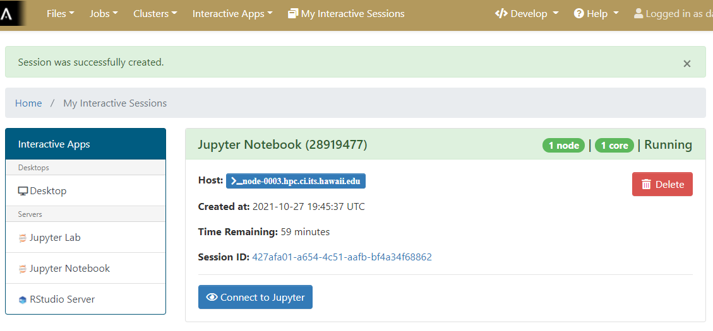
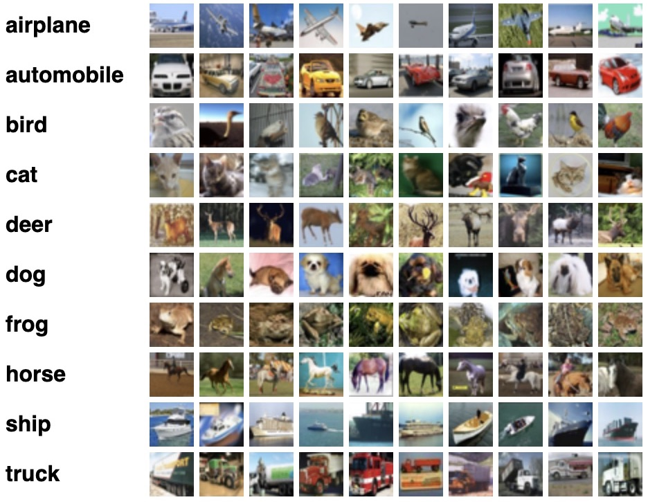
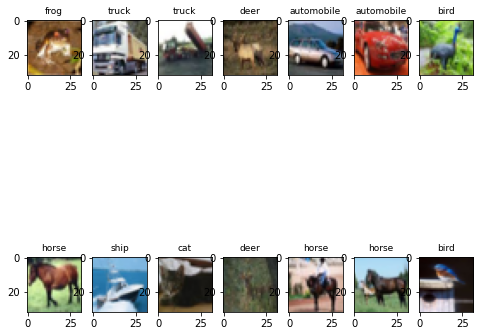
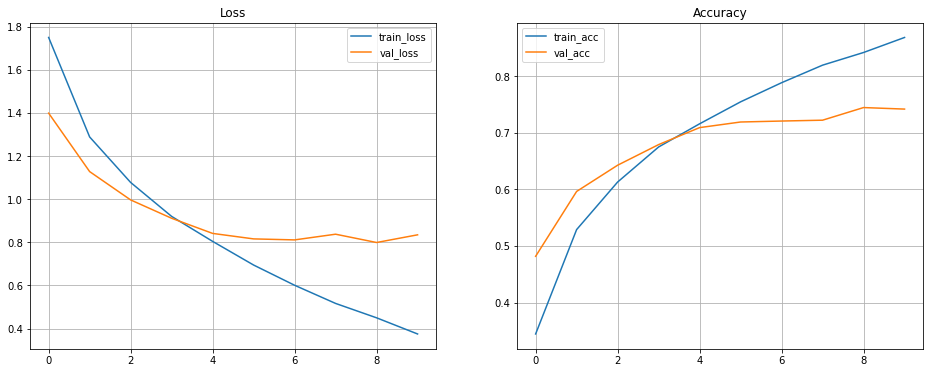
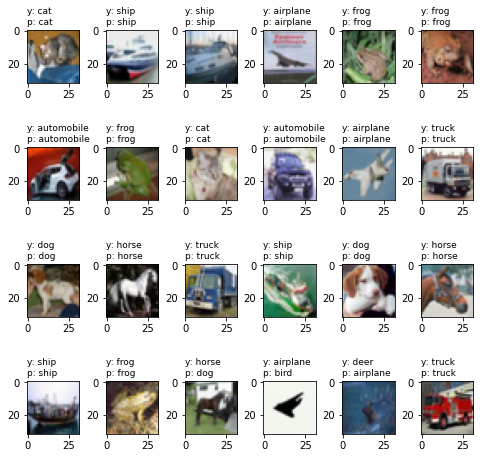

## Jupyter Lab as an Interactive Application in Open OnDemand
As we previously saw, Open OnDemand allows us to use interactive applications, one of which is Juypter Lab.
  {% include figure.html url="" max-width="50%"
   file="/fig/ood_form.png"
   alt="Connect to cluster" caption="" %}
The form is used to specify what resources you want, which are then placed into a queue with other waiting jobs and will start to run your job 
as soon as the resources requested are available.  
> ## Under the hood
> 
> The Open On Demand form for interactive applications defines a job script and passes it to the HPC systems job scheduler, 
> taking the burden of how to start the application on the HPC system and how to write a job script that the job scheduler 
> can understand off of the user.
>
{: .callout}
                                             
> ## Starting an Interactive session of Jupyter Lab and Open Jyupyter Lab
>
> As we will be working in Jupyter Lab to explore some concepts when working with HPC systems and deep learning your challenge is to 
> start an interactive application of Jupyter Lab with the following parameters
> * **Partition:** workshop
> * **Number of hours:** 3
> * **Number of Tasks per Node**: 1
> * **Number of cores per task:** 4
> * **GB of Ram:** 24 GB
> * **Number of GPUs requested:** 1
> * **GPU Type:** Any
>
> Once the interactive session is running Connect to the jupyter session by click the "Connect to Jupyter" button.
> 
> > ## Solution
> > 
> >
> {: .solution}
{: .challenge}                                             
                                             
  
## Why use Jupyter?

For python based data science and machine learning applications, Jupyter notebook is a great platform because:
1. you can store your data, code, visualizations, equations, text, outputs all in one place,
2. you can easily share your work easily in different formats like JSON, PDF, html,
3. it supports more than 40 programming languages and has an interactive output.

### Jupyter Lab vs Jupyter Notebook

Jupyter notebook allows you to access ipython notebooks only (.ipynb files), i.e. it will create a computational environment which stores 
your code, results, plots, texts etc. And here you can work in only one of your environments. But Jupyter Lab gives a better user interface 
along with all the facilties provided by the notebook. It is a flexible, web based application with a modular structure where one can access 
python files (.py), ipython notebooks, html or markdown files, access file browser (to upload, download, copy, rename, delete files), work with 
multiple Jupyter notebooks and environments, all in the same window. It is more preferred for Data Science and Machine Learning research because 
one can also do data visualization, add data, code, texts, equations all in one place and use big data tools.
  
> ## How does JupyterLab work?
>
> You write your code or plain text in rectangular “cells” and the browser then passes it to the back-end “kernel”, which runs your code and returns output.
>
{: .callout}

> ## File extensions and content
> 
> .ipynb file is a python notebook which stores code, text, markdown, plots, results in a specific 
> format but .py file is a python file which only stores code and plain text (like comments etc).
>
{: .callout} 

## How to access and install softwares and modules on a cluster?
  
### Using a package manager

Working with Python requires one to have different packages installed with a specific version which gets updated once in a while. On Mana, there are 
software packages already installed on the cluster which one can use to install the required libraries, softwares and can even choose which version to install.
You can use following commands to see what modules are available on the cluster or which ones are already loaded or to load a specific module in your environment:

~~~
  module avail
  module list 
  module load <MODULE_NAME>
~~~
{: .language-bash}

### So what is an environment then?
 
Sometimes different applications require different versions of the Python packages than the one you've been using and this is where a Python environment comes in handy.  
An environment (or a conda environment specifically, which we'll discuss later) is a directory that contains a specific collection of python packages and their different versions that you have installed. There are 2 most popular tools to set up yur environment:
 
1. Pip: a tool to install Python software packages only. 

2. Anaconda (or Conda): cross platform package and environment manager which lets you access C, C++ libraries, R package for scientific computing along with Python.
  
> ## Note  
> 
> Packages contains all the files you need for the modules it supplies
>
{: .callout}

### Anaconda

This is a popular package manager in scientific computing which handles the Python and R programming language realted dependencies rather easily. It is preferred more because:
- it has a clear directory structure which is easy to understand,
- it allows you to install softwares written in any programming language,
- it gives you a flexibility to create different environments with different software versions (and can install pip packages as well),
- one can use both CLI and GUI.
{% include figure.html url="" max-width="50%"
   file="/fig/Anaconda+Python.png"
   alt="Anaconda + Python" caption="" %}

> ## Environment isloation
>   
> If you try to access a library with different version based on your project, pip may throw an error. 
> To create isolated environments you can use virtual environment (venv) with pip.
>
{: .callout}

> ## Environment setup
>  
> - Create a conda environment
> 
> ~~~
> module load lang/Anaconda3
> conda create --name tf2
> source activate tf2
> ~~~
> {: .language-bash}
> 
> - Install relevant libraries
> 
> ~~~
> conda install tensorflow-gpu
> conda install matplotlib
> conda install tensorflow
> conda install keras
> ~~~
> {: .language-bash}
>
> > ## Difference between conda envirnment and kernel
> >
> > Although we created a conda environment, the Jupyter notebook still cannot access it because "conda" is the directory that contains all the 
> > installed conda packages but it is the "kernel" that runs the user's code and can use and access different conda environments, if required. 
> > A kernel is the computational engine that executes the code contained in Jupyter notebook or it is the interface which tells Jupyter notebook which kernel it should use to access the packages and softwares.
> >
> {: .callout}
> 
> - Let's create a python kernel
> 
> ~~~
> conda install ipykernel
> python -m ipykernel install --user --name tf2 --display-name tf2
> ~~~
> {: .language-bash}
>
{: .challenge} 

## Deep Learning Tutorial

This is a basic image classification tutorial from CIFAR-10 dataset using tensorflow. 

> ## Tensorflow
>
> It is an open source software used in machine learning particularly for training neural networks. 
> We'll define our model using 'Keras'- a high level API which acts as an interface between tensorflow 
> and python and makes it easy to build and train models. You can read more about it [here](https://www.tensorflow.org/#).
>
{: .callout}
  
### CIFAR-10 dataset
  
CIFAR-10 is a common dataset used for machine learning and computer vision research. It is a subset of 80 million tiny image dataset and consists of 60,000 images. The images are labelled with 10 different classes. So each class has 5000 training images and 1000 test images. Each row represents a color image of 32 x 32 pixels with 3 channels (RGB).   
  
 
 
  
### Basic workflow of Machine Learning
  
1. Collect the data
2. Pre-process the data
3. Define a model
4. Train the model
5. Evaluate/test the model
6. Improve your model

> ## Working with Cifar-10 dataset
>
> * Import all the relevant libraries
> 
> ~~~
> import numpy as np
> import matplotlib.pyplot as plt
> 
> import tensorflow as tf
> import h5py
> import keras
> from keras.datasets import cifar10
> from tensorflow.keras.models import Sequential
> from tensorflow.keras.layers import Dense, Conv2D, Flatten, MaxPooling2D, Input, InputLayer, Dropout
> import keras.layers.merge as merge
> from keras.layers.merge import Concatenate
> from tensorflow.keras.utils import to_categorical
> from tensorflow.keras.optimizers import SGD, Adam
> 
> %matplotlib inline
> ~~~
> {: .language-python}
>
> 
> * Check for CPU and GPU
> 
> ## How to check if you're using GPU ?
> ~~~
> tf.config.list_physical_devices('GPU')
> ~~~
> {: .language-python}
> 
> Now, how would you check for CPU ?
>
> > ## Solution
> > ~~~
> > tf.config.list_physical_devices('CPU')
> > ~~~
> > {: .language-python}
> {: .solution}
> 
>
> > ## Is GPU necessary for machine learning?
> > No, machine learning algorithms can be deployed using CPU or GPU, depending on the applications. 
> > They both have their distinct properties and which one would be best for your application depends on 
> > factors like: speed, power usage and cost. CPUs are more general purposed processors, are cheaper and 
> > provide a gateway for data to travel from source to GPU cores. But GPU have an advantage to do parallel 
> > computing when dealing with large datasets, complex neural network models. The difference between the 
> > two lies in basic features of a processor i.e. cache, clock speed, power consumption, bandwidth and number of cores. 
> > Read more that [here](https://thinkml.ai/cpu-vs-gpu-in-machine-learning-algorithms-which-is-better/#).
> {: .discussion}
>  
> * Load the data and analyze its shape
> 
> ~~~
> (x_train, y_train), (x_valid, y_valid) = cifar10.load_data()
> nb_classes = 10
> class_names = ['airplane', 'automobile', 'bird', 'cat', 'deer', 'dog', 'frog', 'horse', 'ship', 'truck']
> print('Train: X=%s, y=%s' % (x_train.shape, y_train.shape))
> print('Test: X=%s, y=%s' % (x_valid.shape, y_valid.shape))
> print('number of classes= %s' %len(set(y_train.flatten())))
> print(type(x_train))
> ~~~
> {: .language-python}
>
> > ## Solution
> > ~~~
> > Train: X=(50000, 32, 32, 3), y=(50000, 1)
> > Test: X=(10000, 32, 32, 3), y=(10000, 1)
> > number of classes= 10
> > <class 'numpy.ndarray'>
> > ~~~
> > {: .language-python}
> >
> {: .solution}
> 
> * Plot some examples 
> 
> ~~~
> plt.figure(figsize=(8, 8)) 
> for i in range(2*7):
>     # define subplot
>     plt.subplot(2, 7, i+1)
>     plt.imshow(x_train [i])
>     class_index = np.argmax(to_categorical(y_train[i], 10))
>     plt.title(class_names[class_index], fontsize=9)
> ~~~    
> {: .language-python}
> 
> > ## Solution
> > 
> >
> {: .solution}
>
> * Convert data to HDF5 format
> 
> ~~~
> with h5py.File('dataset_cifar10.hdf5', 'w') as hf:
>     dset_x_train = hf.create_dataset('x_train', data=x_train, shape=(50000, 32, 32, 3), compression='gzip', chunks=True)
>     dset_y_train = hf.create_dataset('y_train', data=y_train, shape=(50000, 1), compression='gzip', chunks=True)
>     dset_x_test = hf.create_dataset('x_valid', data=x_valid, shape=(10000, 32, 32, 3), compression='gzip', chunks=True)
>     dset_y_test = hf.create_dataset('y_valid', data=y_valid, shape=(10000, 1), compression='gzip', chunks=True)
> ~~~
> {: .language-python}
> 
> > ## What is HDF5 file?
> > 
> > HDF5 file format is a binary data format which is mainly used to store large, heterogenous files. It provides fast, parallel I/O processing. You can learn more 
> > about it [here](https://www.hdfgroup.org/solutions/hdf5/#) and [here](https://www.christopherlovell.co.uk/blog/2016/04/27/h5py-intro.html#).
> {: .callout}
>
> * Define the model
> 
> ~~~
> model = tf.keras.Sequential()
> model.add(InputLayer(input_shape=[32, 32, 3]))
>
> model.add(Conv2D(filters=32, kernel_size=3, padding='same', activation='relu'))
> model.add(MaxPooling2D(pool_size=[2,2], strides=[2, 2], padding='same'))
>
> model.add(Conv2D(filters=64, kernel_size=3, padding='same', activation='relu'))
> model.add(MaxPooling2D(pool_size=[2,2], strides=[2, 2], padding='same'))
>
> model.add(Conv2D(filters=128, kernel_size=3, padding='same', activation='relu'))
> model.add(MaxPooling2D(pool_size=[2,2], strides=[2, 2], padding='same'))
>
> model.add(Conv2D(filters=256, kernel_size=3, padding='same', activation='relu'))
> model.add(MaxPooling2D(pool_size=[2,2], strides=[2, 2], padding='same'))
>
> model.add(Flatten())
>
> model.add(Dense(256, activation='relu'))
> model.add(Dropout(0.2))
>
> model.add(Dense(512, activation='relu'))
> model.add(Dropout(0.2))
>
> model.add(Dense(10, activation='softmax'))
>
> model.summary()
> ~~~
> {: .language-python}
>
> * Define the data generator
>
> ~~~
> class DataGenerator(tf.keras.utils.Sequence):
>    
>     def __init__(self, batch_size, test=False, shuffle=True):
>        
>         PATH_TO_FILE = 'dataset_cifar10.hdf5'
>        
>         self.hf = h5py.File(PATH_TO_FILE, 'r')         
>         self.batch_size = batch_size
>         self.test = test
>         self.shuffle = shuffle
>        self.on_epoch_end()
>
>     def __del__(self):
>         self.hf.close()
>        
>     def __len__(self):
>         return int(np.ceil(len(self.indices) / self.batch_size))
>
>     def __getitem__(self, idx):
>         start = self.batch_size * idx
>         stop = self.batch_size * (idx+1)
>        
>         if self.test:
>             x = self.hf['x_valid'][start:stop, ...]
>             batch_x = np.array(x).astype('float32') / 255.0
>             y = self.hf['y_valid'][start:stop]
>             batch_y = to_categorical(np.array(y), 10)
>         else:
>             x = self.hf['x_train'][start:stop, ...]
>             batch_x = np.array(x).astype('float32') / 255.0
>             y = self.hf['y_train'][start:stop]
>             batch_y = to_categorical(np.array(y), 10)
>
>         return batch_x, batch_y
>
>     def on_epoch_end(self):
>         if self.test:
>             self.indices = np.arange(self.hf['x_valid'][:].shape[0])
>         else:
>             self.indices = np.arange(self.hf['x_train'][:].shape[0])
>            
>         if self.shuffle:
>             np.random.shuffle(self.indices)
>  ~~~
> {: .language-python}
> 
> * Generate batches of data for training and validation dataset
>
> ~~~
> batchsize  = 250 
> data_train = DataGenerator(batch_size=batchsize)
> data_valid = DataGenerator(batch_size=batchsize, test=True, shuffle=False)
> ~~~
> {: .language-python}
> 
> * First, let's train the model using CPU
>
> ~~~
> with tf.device('/device:CPU:0'):
>     history = model.fit(data_train,epochs=10,
>                         verbose=1, validation_data=data_valid)
> ~~~
> {: .language-python}
>                          
> * Now, lets try with GPU to compare its performance with CPU
>
> ~~~
> from tensorflow.keras.models import clone_model
> new_model = clone_model(model)
> opt = keras.optimizers.Adam(learning_rate=0.001)
> new_model.compile(optimizer=opt, loss='categorical_crossentropy', metrics=['accuracy'])  
>                         
> ##### train the new model with GPU #####
> ~~~
> {: .language-python}
> 
> > ## Solution
> > ~~~
> > with tf.device('/device:GPU:0'):
> >     new_history = new_model.fit(data_train,epochs=10,
> >                                 verbose=1, validation_data=data_valid)
> >  ~~~      
> >  {: .language-python}                       
> {: .solution}
>                                  
> * Plotting the losses and accuracy for training and validation set
>
> ~~~
> fig, axes = plt.subplots(1,2, figsize=[16, 6])
> axes[0].plot(history.history['loss'], label='train_loss')
> axes[0].plot(history.history['val_loss'], label='val_loss')
> axes[0].set_title('Loss')
> axes[0].legend()
> axes[0].grid()
> axes[1].plot(history.history['accuracy'], label='train_acc')
> axes[1].plot(history.history['val_accuracy'], label='val_acc')
> axes[1].set_title('Accuracy')
> axes[1].legend()
> axes[1].grid()
> ~~~
> {: .language-python}
> 
> > ## Solution
> > 
> {: .solution}
> 
> * Evaluate the model and make predictions
> 
> ~~~
> x = x_valid.astype('float32') / 255.0
> y = to_categorical(y_valid, 10)
> score = new_model.evaluate(x, y, verbose=0)
> print('Test cross-entropy loss: %0.5f' % score[0])
> print('Test accuracy: %0.2f' % score[1])
> 
> y_pred = new_model.predict_classes(x)
> ~~~
> {: .language-python}
> 
> * Plot the predictions
>
> ~~~
> plt.figure(figsize=(8, 8)) 
> for i in range(20):
>     plt.subplot(4, 5, i+1)
>     plt.imshow(x[i].reshape(32,32,3))
>     index1 = np.argmax(y[i])
>     plt.title("y: %s\np: %s" % (class_names[index1], class_names[y_pred[i]]), fontsize=9, loc='left')
>     plt.subplots_adjust(wspace=0.5, hspace=0.4)
> ~~~ 
> {: .language-python}
>  
> > ## Solution
> > 
> > 
> {: .solution}
>    
{: .challenge}

## Other resources to do Machine Learning

* You can use [Google Colab](https://colab.research.google.com/#) which uses Jupyter notebooks too but on Google server. Here you can get free limited compute resources (even GPU) and upgrade your account (for TPU) if you want more. The code usually runs on Google servers on cloud and is connected to your google account so all your projects will be saved in your Google Drive. 
* Microsoft [Azure notebook](https://visualstudio.microsoft.com/vs/features/notebooks-at-microsoft/#) is similar to Google Colab with cloud sharing functionality but provides more memory.
* Kaggle 
* Amazon Sage Maker


