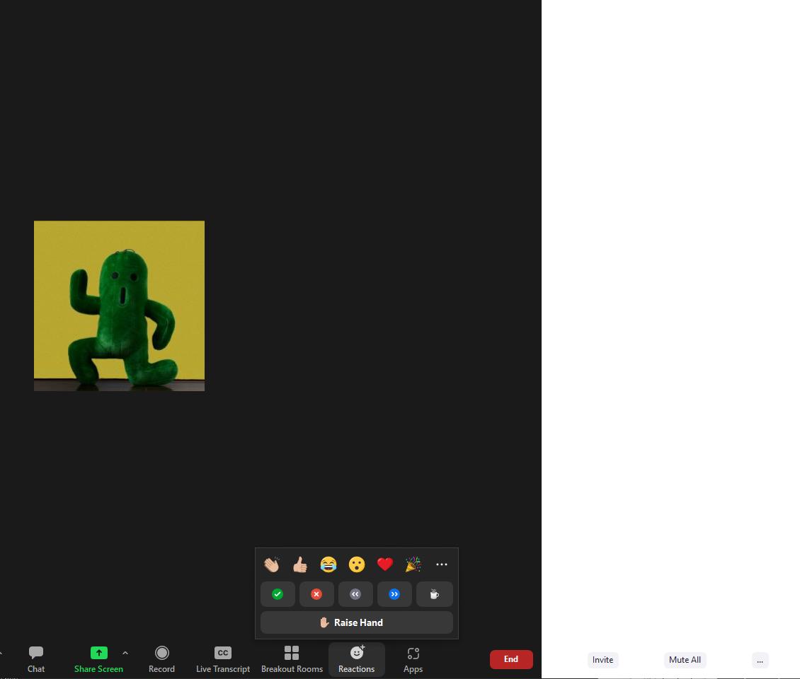

# Required files

Please download the following file to your local computer.  We will be uploading it and using it during the workshop.  

**Download using the "save as" function (right click save as)**
* <a href ="https://raw.githubusercontent.com/CI-TRACS/High_Performance_Computing/gh-pages/code/participants-copy.ipynb">notebook</a>

---
# Feedback during the workshop

We encourage participants to write comments and questions in chat and use the <a href="https://support.zoom.us/hc/en-us/articles/115001286183-Nonverbal-feedback-during-meetings#:~:text=To%20provide%20nonverbal%20feedback%20or,icon%20again%20to%20remove%20it." target="_blank" >non-verbal feedback features of zoom</a>.

If at any time you have a question that is easier to talk through than writing in chat, please indicate in chat you have a question or raise your virtual hand so that we know you wish to speak.


